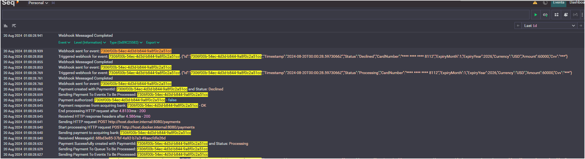

# Payment Gateway API

## Overview
The Payment Gateway API is a solution designed to handle payment processing through an API. It is built using ASP.NET 8.

This repository contains the code for the Payment Gateway API, along with integration tests and supporting services such as Cosmos DB, Azurite (for Azure Storage emulation), and Seq (for logging). The solution leverages Docker and Docker Compose.

## Basic Solution Structure


# Architecture Overview of the Payment Gateway

- **Client**:
  - The end-user that initiates a payment request via the Payment Gateway API.

- **Merchant API Gateway**:
  - Serves as the front door to the payment processing system.
  - Handles incoming requests from clients and exposes the necessary endpoints to interact with the payment services.
  - Uses CQRS with Mediator for separation of concerns

- **Payment Request Handler**:
  - Manages the initial processing of payment requests.
  - Validates and formats the payment data into a `PaymentDto` object, preparing it for further processing.
  - Sends to the queues

- **Payment Queue**:
  - A message queue that temporarily holds payment requests.
  - Helps in decoupling the request reception from the processing, allowing the system to handle varying loads efficiently.

- **PaymentGateway HandlerService**:
  - Acts as the orchestrator for payment processing.
  - Pulls payment requests from the Payment Queue and coordinates the entire payment processing flow.

- **CreatePayment Processor**:
  - Handles the creation and initial processing of payment requests. `CREATING` state
  - Stores the initial payment data into the Payment Store.

- **ProcessPayments Handler**:
  - Responsible for the core payment processing logic by sending the request to the Acquirer.
  - Updates status to `FAILED` or `AUTHORIZED`

- **Acquirer API**:
  - Fake banking application provided to fake the processes the actual payment.

- **Event Queue**:
  - A queue that holds events related to payment processing.

- **Event Processor**:
  - Processes events from the Event Queue.
  - Sends update `STATUS` messages to webhooks (code is there but will log it instead for simplicity)

- **Feedback Mechanism**:
  - Once the payment is processed, the outcome is recorded in the Payment Store.

## Summary

This high-level architecture outlines how the Payment Gateway system manages payment requests from initiation by a client through to completion, including handling all necessary validations, processing, storage, and event management. The architecture leverages asynchronous processing through queues to manage load and ensure reliable operation, integrating with external APIs to process payments and maintaining accurate records in a central Payment Store.

More can be found here for per application information: [Technical Documents](Documentation/TechDocs.md)

---
### **Docker Setup**
   - **Docker Compose Files**:
     - `docker-compose.yml`: Defines the services needed for the API, including the API itself, Cosmos DB emulator, Azurite, Seq, and a test service.
     - `docker-compose-workflow.yml`: A variant of the Docker Compose file, created for Github workflow pipeline.
   - **Supporting Services**:
     - **Azurite**: A local emulator for Azure Storage services (Queues).
     - **Cosmos DB Emulator**: Provides a local Cosmos DB environment for testing.
     - **Seq**: A centralized logging platform that captures and displays logs from the API.
---
### **GitHub Actions Workflow**
   - **CI/CD Pipeline**: 
   *Note: Cosmos takes a while to start why all the delays and health checks created
     - The `pipeline.yml` file defines the GitHub Actions workflow to automate the build, test, and deployment processes.
     - **Steps**:
       - Checkout the code.
       - Set up Docker and Docker Compose.
       - Build and run the services using Docker Compose.
       - Wait for the API to be ready (using a health check).
       - Run integration tests.
       - Shut down services and clean up resources.
       - Display logs for debugging if needed.

## Environment Setup
### Prerequisites
- **Docker**: Ensure Docker is installed and running on your machine.
- **.NET SDK**: The solution targets .NET 8.0

### Running the Solution Locally
**Clone the Repository**:
   ```sh
   - git clone https://github.com/ShaunJahn/checkout.com.payment.gateway.git
   - cd checkout.com.payment.gateway
   - docker-compose up --build -d
   - docker-compose run tests (if you want to force a test rerun)
   - docker-compose down OR  ./Cleanup.sh(Bash) to deleted created files
```

- Once services are running, open http://localhost:8082/swagger/index.html for the swagger docs to test manually


- Create a token and use it for the swagger Authorize section


- Execute the POST payment with the `VALID` example given
- GET the `PAYMENT` by using the new `PAYMENTID`


### Logs
 - View logs at http://localhost:5000/#/events?range=1d
 

## Extras and Enhancements

- **GitHub Workflow Integration**:
  - Added a GitHub Actions workflow to automate the build and test processes.

- **Integration Testing**:
  - Implemented API integration tests.

- **Docker Compose with Health Checks**:
  - Enhanced the Docker Compose setup to include health checks, ensuring that services like the Cosmos DB emulator are up and ready before the API starts processing requests.

- **Polly for Retries**:
  - Integrated Polly for handling transient faults by adding retry policies in sections of the application.

## Improvements todo

1. **Advanced Monitoring and Alerts**:
   - Implement a more comprehensive monitoring system with alerts to proactively detect and respond to issues in production such as metrics and tracing.
   - Increase logging and logging context

2. **Enhanced Security**: Add OAuth2.0 such as Azure AD.
   
3. **Break solution into Microservices**

5. **Switch to Azure Service Bus**: Implement dead letter queue for poison messages.

6. **Event Hub**: Change the event queue to event hub for a more scalable solution

7. **Improve code base**: Separate contracts and use mappers to split contracts up per service (Maybe use AutoMapper)
